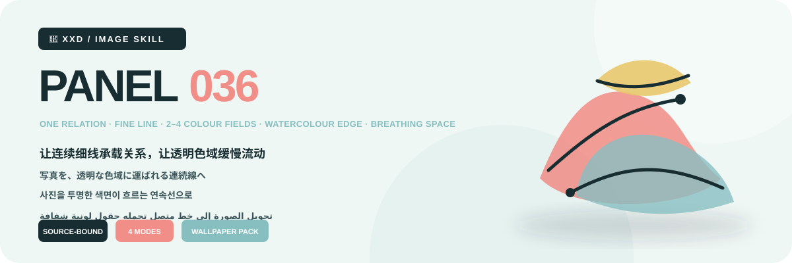
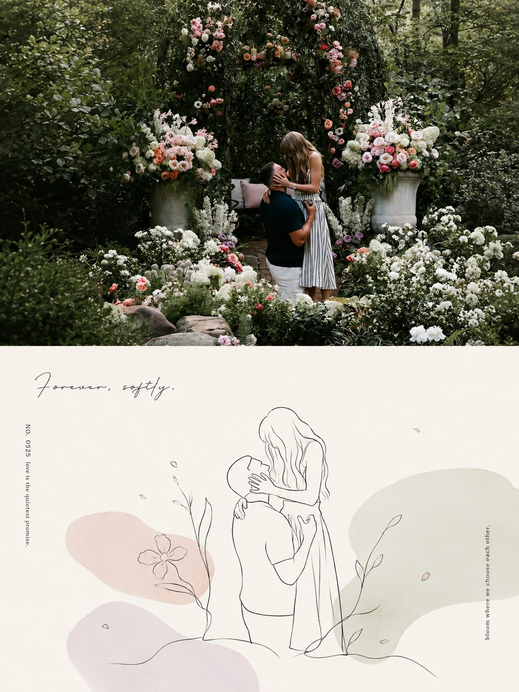
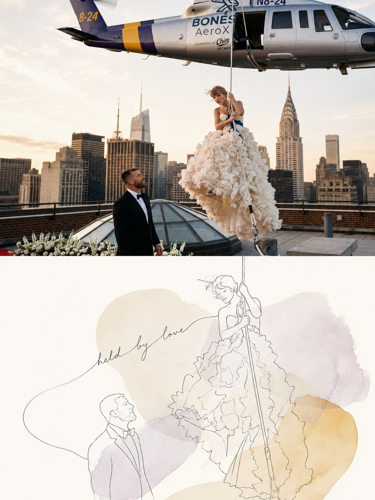
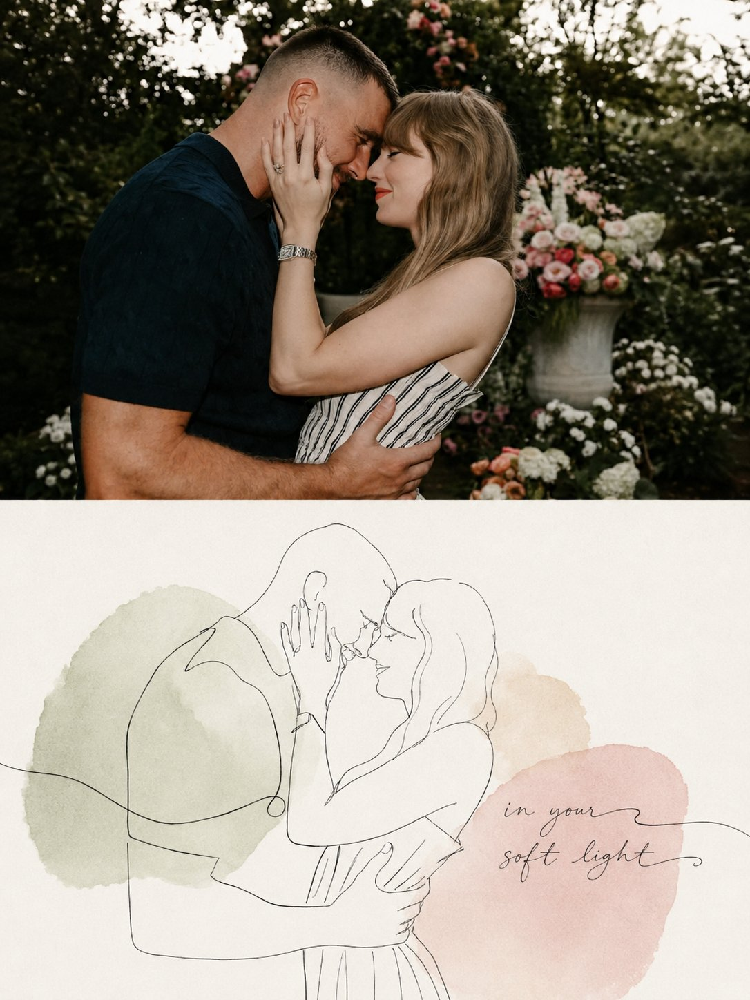
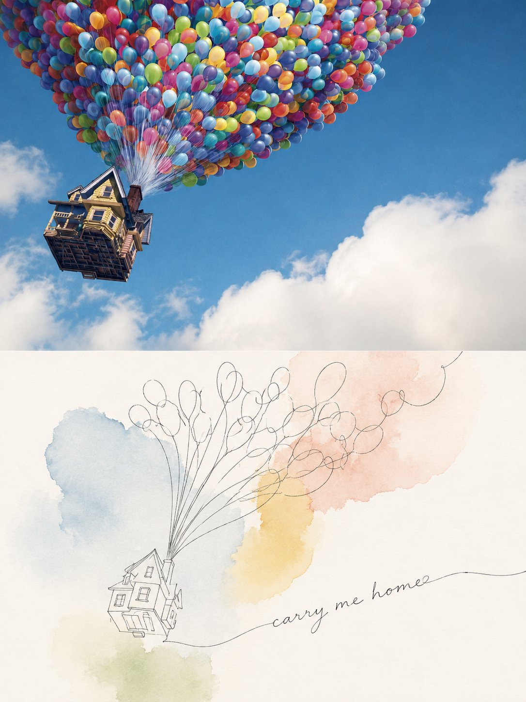

<p align="center"></p>

<div align="center">

# 🦁 XXD Panel 036

### Turn photographs into continuous lines carried by translucent colour

[](./SKILL.md)
[](#)
[](#)

<a href="README.md">简体中文</a> · <strong>English</strong> · <a href="README.ja.md">日本語</a> · <a href="README.ko.md">한국어</a> · <a href="README.ar.md">العربية</a>

</div>

<div>

> ONE RELATION · FINE LINE · 2–4 COLOUR FIELDS · WATERCOLOUR EDGE · BREATHING SPACE

The source becomes one recognisable relation drawn with a few naturally paused lines. Two to four translucent, source-derived colour fields follow contour, movement, negative space, and emotional gravity rather than acting as decoration.

## Why this Skill exists

The style is source-dependent, not a decorative preset. Its operative transformation is:

```text
lock identity and relation → find one emotional or directional proposition → redraw with sparse continuous hand line → distribute 2–4 source-derived translucent organic colour fields → let overlaps create restrained mixed colour → preserve paper-white breathing space → make native copy another line in the composition
```

If an unrelated photograph could replace the source without materially changing recognition, construction, placement, material, colour, whitespace, and copy, the result does not belong to this Panel.

## The visual contract

- Preserve at least three cues across contour, pose, direction, action, opening, distance, or relation.
- Use fine black-grey continuous line with natural pauses, slight hand hesitation, omission, connection, extension, and unfinished edges; never mechanically trace.
- Use two to four asymmetric low-to-medium-saturation, high-value colour fields derived from the source; their soft watercolour blooms must follow subject structure and negative space.
- Keep broad paper-white breathing room. Colour overlaps may create a small transparent mixed hue, but never a digital gradient, hard vector blob, regular circle, rainbow spread, or heavy fill.
- Let one core relation remain dominant; placement may be offset, suspended, cropped, or gently extended according to source direction.

Aesthetic constraints and rejection rules live only in the [original source brief](references/036-source.md); the Skill and runtime adapter handle delivery variables only. [Skill workflow](SKILL.md) · [English runtime adapter](references/xxd-panel-036-prompt.en.md)

## Samples · From X

> [Xiaoxiaodong (@xiaoxiaodong01)](https://x.com/xiaoxiaodong01/status/2090745034257903827) · 2026-08-21<br>
> GPT2 x 线条 x 色块 x 治愈 x 美学提示词 x VOL.036

<table>
  <tr>
    <td width="50%"><a href="https://x.com/xiaoxiaodong01/status/2090745034257903827"></a></td>
    <td width="50%"><a href="https://x.com/xiaoxiaodong01/status/2090745034257903827"></a></td>
  </tr>
  <tr>
    <td width="50%"><a href="https://x.com/xiaoxiaodong01/status/2090745034257903827"></a></td>
    <td width="50%"><a href="https://x.com/xiaoxiaodong01/status/2090745034257903827"></a></td>
  </tr>
</table>

<p align="center"><a href="https://x.com/xiaoxiaodong01/status/2090745034257903827">View the original post and full prompt →</a></p>

These samples demonstrate the 036 aesthetic motive. Their subjects, composition, palette, copy, and earlier canvas ratio never become generation references or current defaults.

## The original brief is authoritative

`references/036-source.md` is this project's sole creative and aesthetic authority. The Skill no longer summarizes or expands it, and it does not impose a shared palette, colour plan, aesthetic motive, title, or microcopy package. GPT Image 2 follows that brief's own rules for colour, material, composition, whitespace, wording, and typography.

Mode and size change only the legacy 3:4 top-bottom container. In left-right mode, the brief's upper photo and lower design map to the left and right. In design-only and wallpaper modes, the lower design language expands across the whole canvas. Every other source-brief instruction remains active.

## Four combinable output modes

Select one or more of `top-bottom`, `left-right`, `design-only`, and `wallpaper-pack`. Paired work is generated as one complete canvas by default; deterministic composition is only a fallback after a failed retry, for pixel-identical source preservation, or for lossless size calibration.

The paired balance is a visual composition target, not a seam, midpoint-percentage, or pixel-coordinate test. Minor offsets do not fail a result; deterministic splitting is used only when the user explicitly requests pixel-exact panel geometry.

Ordinary sizes are also multi-select: auto-fit, source aspect, 1:1, 3:4, 4:3, 4:5, 5:4, 2:3, 3:2, 9:16, 16:9, 21:9, 5:7, 7:5, or custom ratios/exact pixels. There is no silent default. Every distinct aspect is independently recomposed from the same verbatim source brief.

Wallpaper packs may be linked or independent. A linked pack creates one anchor image, then recomposes each remaining device from the original source plus that anchor; it never crops one image into four sizes.

## Text modes

Before generation, resolve one of three choices:

1. **Model generates text from the original prompt**: the user supplies only the language or locale; GPT Image 2 follows the source brief's own wording, amount, tone, and typography logic.
2. **Use my exact text**: pass it verbatim, without rewriting, translating, or adding a title; typography still follows the source brief.
3. **No text**: prohibit visible text and pseudo-text.

The outer Skill no longer pre-writes titles, microcopy, or copy packages. Output language is resolved separately from the interface language and is never guessed from a person, scene, or filename.

## Complete-canvas first, raster-only delivery

The image model owns the aesthetics of the entire finished composition; paired layouts also default to one complete-canvas generation. `scripts/compose_panel.py` remains only for condition-based recovery, lossless pixel calibration, and read-only audit. It is not run pre-emptively and does not judge aesthetic success.

Every deliverable is a raster PNG and every invocation creates a fresh task under `~/Desktop/xxd/`. The configured image route exposes sanitised status only—never providers, endpoints, credentials, headers, prompts, responses, or account details. SVG, HTML, Canvas, diagrams, and programmatic drawing are not substitutes for the final artwork.

## Capability-adaptive questions and inline parameters

The same Skill adapts to the host's real interaction capabilities and never presents decorative symbols as clickable controls:

- **When Claude Code exposes `AskUserQuestion + multiSelect: true`**: modes and sizes use genuine checkboxes; text mode and wallpaper relationship use single-select. Common sizes are grouped into square, portrait, and landscape checkbox questions, selections accumulate across groups, and custom sizes use free input.
- **When Codex exposes only `request_user_input`**: use it only for mutually exclusive fields such as text mode and wallpaper relationship. Do not misrepresent modes or sizes as single-choice; collect them through clear combination input.
- **With no interactive question tool**: use two typed rounds—modes first, then sizes plus text. Never draw fake `- [ ]` boxes or ask the user to switch to Plan mode merely to obtain a form.

The second round initially shows only Smart recommendation, Source aspect, Common ratios, and Custom. Expand the full library only when requested: square `1:1`; portrait `3:4, 4:5, 2:3, 9:16, 5:7`; landscape `4:3, 5:4, 3:2, 16:9, 21:9, 7:5`. Any ratios may be combined, and exact pixels are always accepted.

All settings can also be passed inline:

```text
/xxd-panel-036 photo.jpg --mode top-bottom,design-only --size auto,3:4,9:16 --text prompt --locale ja-JP
```

Supported parameters are `--mode`, repeatable or comma-separated `--size`, `--text prompt|exact|none`, `--locale`, `--copy`, `--wallpaper linked|independent`, `--wallpaper-size`, and `--out`. Complete parameters skip preflight; partial parameters trigger only missing questions.

## Image-model priority

GPT Image 2 is the default first choice. It keeps this project's established workflow: high-fidelity source reference, explicit whole-canvas selection before generation, one complete-canvas generation for paired modes, and scripted composition only as a conditional fallback.

Seedance 5.0 Pro, Nano Banana Pro (Gemini Image Pro), Nano Banana 2 (Gemini Image Flash), or another compatible bitmap model may also be used when it is actually available through the current tools or configured routes and can satisfy source fidelity, whole-canvas ratio, target-language text, and linked-wallpaper multi-reference requirements. An alternative changes only the generation route; it must not change modes, canvas, copy, locale, wallpaper relationship, or the complete-canvas-first strategy.

If no suitable route is available, the Skill asks the user to enable an image-generation tool or provide an API key. User-provided credentials may be used for the current task without being echoed, displayed, logged, or exposed. They are not persisted, and provider, account, billing, or global route configuration is not modified, unless the user explicitly requests that configuration change.

## Get started

```bash
git clone https://github.com/nevertoday/xxd-panel-036.git
mkdir -p ~/.codex/skills
ln -s "$(pwd)/xxd-panel-036" ~/.codex/skills/xxd-panel-036
```

Claude Code users may link the same folder under `~/.claude/skills/xxd-panel-036`. Restart the agent session after installation.

```text
$xxd-panel-036
Use this photograph, ask me for the modes and copy setting, then generate fresh raster outputs.
```

Full specifications: [Skill workflow](SKILL.md) · [source archive](references/036-source.md) · [English runtime adapter](references/xxd-panel-036-prompt.en.md) · [Chinese runtime adapter](references/xxd-panel-036-prompt.zh-CN.md)

## About XXD

XXD is Xiaoxiaodong's abbreviated brand name. Created and maintained by [@xiaoxiaodong01](https://x.com/xiaoxiaodong01).

## Support and membership

### In-depth consultation · CNY 299/hour

One-to-one in-depth consultation for using Skills. Contact Xiaoxiaodong through WeChat. [WeChat](https://xiaoxiaodong.pages.dev/assets/wechat-qr.png)

### Xiaoxiaodong Skills User Community · CNY 99

A one-time fee joins the Skills user community for workflow sharing and peer discussion; hourly consultation is separate.

### Knowledge Planet + Member Prompt Library · CNY 699/year

One annual payment opens both Knowledge Planet and the member prompt library. Join either side, then contact Xiaoxiaodong on WeChat for the other access.

[Knowledge Planet](https://wx.zsxq.com/group/15554814142882) · [Member Prompt Library](https://vip.xiaoxiaodong.ai/)

<p align="center"><a href="https://xiaoxiaodong.pages.dev/assets/wechat-qr.png"></a></p>

<div align="center"><strong>Lines hold recognition; colour carries the feeling that remains.</strong></div>

---

<div align="center">

## Support this open-source project

Chinese-language support may use Xiaoxiaodong's own WeChat or Alipay reward codes; other editions use Buy Me a Coffee. Support is optional and never changes access to the open-source project.


<p align="center"><a href="https://github.com/nevertoday/zhongguo-traditional-colors/blob/main/docs/images/buy-me-a-coffee-qr.png?raw=true"></a></p>

</div>
</div>
